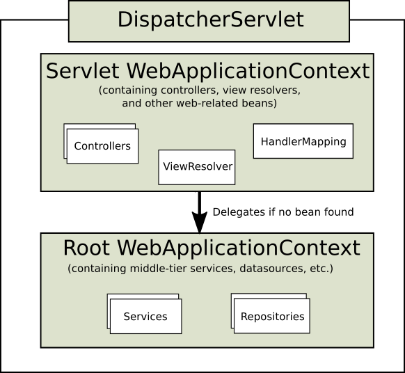
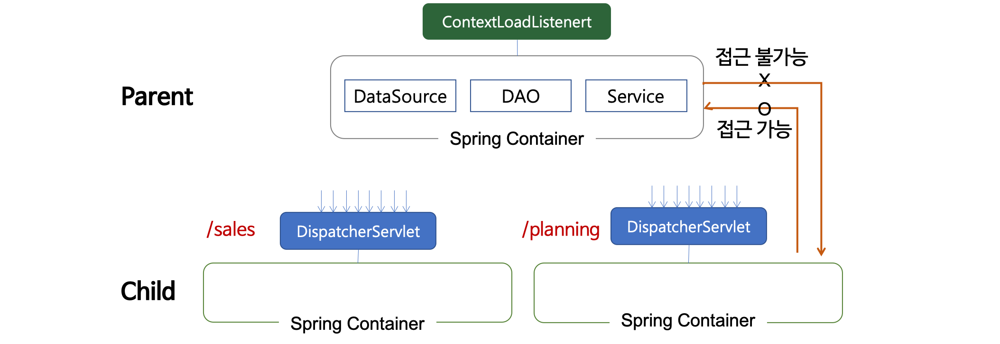

### root-context.xml, servlet-context.xml, web.xml



servlet-context는  web application의 client 요청을 받기 위한 entity point로서의 서블릿의 context 설정이다. 따라서 해당 context의 설정에는 요청에 대한 처리를 해줄 controller의 매핑 설정(handler mapping)과 요청처리 후 view 처리를 어떻게 할 것인가에 대한 설정(view resolver) 등이 존재하게 됨.

 \- 전체 계층구조에서 최상단에 위치한 컨텍스트
 \- 서로 다른 서블릿 컨텍스트에서 공유해야하는 Bean들을 등록해놓고 사용할 수 있다.
 \- 웹 어플리케이션 전체에 적용가능한 DB 연결, 로깅기능등에 이용
 \- Servlet Context에 등록된 Bean 이용 불가능!
 \- Servlet Context와 동일한 Bean이 있을 경우 Servlet Context Bean이 우선된다.
 \- 하나의 컨텍스트에 정의된 AOP 설정은 다른 컨텍스트의 빈에는 영향을 미치지 않는다.


root-context의 경우 web application의 실제 비지니스 혹은 목적을 위한 service layer와 해당 service layer에서 조회 및 처리에 필요한 database와 연결되는 repository layer를 구성하는 bean들에 대한 설정을 하게 됨.

 \- 서블릿에서만 이용되는 컨텍스트
 \- 타 서블릿과 공유하기 위한 Bean들은 루트 웹 어플리케이션 컨텍스트에 등록해놓고 사용해야 한다
 \- DispatcherServlet은 자신만의 컨텍스트를 생성,초기화하고
   동시에 루트 어플리케이션 컨텍스트를 찾아서 자신의 부모 컨텍스트로 사용


두개의 context는 계층 구조를 가지는데 servlet-context에서 root-context에 등록된 bean들에 대한 참조를 가지는 구조로 형성됨


### applicationContext 는 root-context임. 다른곳에서 이름이 다 다르더라


Controller류는 servlet-context.xml

그 외 Service, Dao류는 root-context.xml 등록해야 함 


### Web.xml

web application의 설정을 위한 **배포 서술자** (deployment descriptor)

배포 할 때 Servlet의 정보를 설정해준다.

브라우저가 java servlet에 접근하기 위해 WAS( ex. tomcat)에 필요한 정보를 알려줘야 해당하는 servlet을 호출 할 수 있다.


### Spring MVC에서의 web.xml 

1. **DispatcherServlet**
   - Spring Container를 생성한다. 
		
> Spring Container: Controller의 Lifecycle관리

- 클라이언트의 요청을 처음으로 받는 클래스 (Spring에서 제공)
  
   - 클라이언트의 요청을 Handler(Controller)에 보낸다.
   
   - 그 외에 필요한 것
   
   - - HandlerMapping : 어떤 url을 받을지 결정
   
     - ViewResolver
   
     - > 쇼핑몰의 경우 의류 / 가구에 대한 요청을 별도로 처리 할 수 있다.
       >
       > 각 기능의 요청별로 DispatcherServlet을 할당한다.
```xml
<servlet>
   <servlet-name>salesServlet</servlet-name>
   <servlet-class>org.springframework.web.servlet.DispatcherServlet</servlet-class>
         <!-- contextLoader가 해당 위치의 설정 파일을 읽어, 해당 파일을 dispatcher servlet으로 만든다. -->
   <init-param>
      <param-name>contextConfigLocation</param-name>
      <param-value>/WEB-INF/salesServlet-servlet.xml</param-value>
   </init-param>
   <load-on-startup>1</load-on-startup>
</servlet>
       
<!-- /sales로 시작하는 url 요청을 받아 salesServlet에서 처리한다. -->
<servlet-mapping>
   <servlet-name>salesServlet</servlet-name>
   <url-pattern>/sales</url-pattern>
</servlet-mapping>
```

- <init-param>부분은 생략이 가능하다.
	- <servlet-name>에 설정한 이름 + -servlet.xml 형식으로 설정 파일 이름을 만들고, web.xml과 같은 위치(/WEB-INF 하위)에 있어야 contextLoader가 해당 파일을 찾아서 읽을 수 있다.
	- 위와 같이 설정하면 init-param으로 dispatcher xml파일의 이름 설정하지 않아도 자동으로 로드된다.

2. **ContextLoaderListener**

   - Controller가 공유하는 Bean들을 포함하는 Spring Container를 생산한다.

     > 공유하는 Bean : Dao, DataSource, Service

     

   - 각 Bean에 대한 설정 파일을 따로 생성한다. 

     > service-context.xml : Service관련
     >
     > dao-context.xml : Dao 관련
     >
     > applicationContext.xml : DataSource관련, properties등록, SessionFactory, TransactionManager등
     >
     > security-context.xml : Security관련, BCryptPasswordEncoder 등
     >
     > xxx-servlet.xml : controller관련, ViewResolver, annotation-driven 설정 등

   - DispatcherServlet에 의해 생성된 Bean은 ContextLoaderListener에 의해 생성된 Bean을 참조할 수 있다.

```xml
<!-- 이렇게 등록된 설정 파일에 따라 등록된 Bean들은 모두 공유가 가능하다. -->
<context-param>
  <param-name>contextConfigLocation</param-name>
  <param-value>
    /WEB-INF/service-context.xml
    /WEB-INF/dao-context.xml
    /WEB-INF/applicationContext.xml
    /WEB-INF/security-context.xml
  </param-value>
</context-param>

<listener>
  <listener-class>org.springframework.web.context.ContextLoaderListener</listener-class>
</listener>
```


3. **encodingFilter**
   - 인코딩을 UTF-8로 하는 설정

```xml
<filter>
    <filter-name>encodingFilter</filter-name>
    <filter-class>org.springframework.web.filter.CharacterEncodingFilter</filter-class>
    <init-param>
        <param-name>encoding</param-name>
        <param-value>UTF-8</param-value>
    </init-param>
    <init-param>
        <param-name>forceEncoding</param-name>
        <param-value>true</param-value>
    </init-param>
</filter>

<!-- /의 형식으로 시작하는 url에 대하여 UTF-8로 인코딩 -->
<filter-mapping>
    <filter-name>encodingFilter</filter-name>
    <url-pattern>/*</url-pattern>
</filter-mapping>
```


https://codediver.tistory.com/147