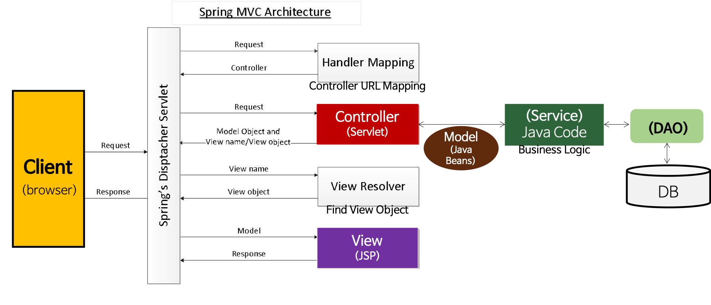

### Spring MVC

- Model
  - 어플리케이션의 상태(data)를 나타낸다.
  - 일반적으로 POJO(Plane Old Java Object)로 구성된다.
  - Java Beans
- View
  - 디스플레이 데이터 또는 프레젠테이션
  - Model data의 렌더링을 담당하며 Html output을 생성한다.
  - JSP
- Controller
  - View와 Model 사이의 인터페이스 역할
  - Model/View에 대한 사용자 입력 및 요청을 수신하여 그에 따른 적절한 결과를 Model에 담아 View에 전달한다.
  - Controller -> Service -> Dao -> DB
  - Servlet

### Spring 프로젝트 구조

- src
  - 개발자가 작성한 Servlet코드가 저장된다.
  - Controller, Model, Service, Dao
  - src/main/java : 개발되는 java 코드 경로
  - src/main/resources : 서버가 실행 될 때 필요한 파일들 경로
  - src/test/java : 테스트 코드 경로
  - src/test/resource : 테스트시에만 사용되는 파일 경로
- Libraries
  - Servlet이나 JSP에서 추가로 사용하는 라이브러리 또는 드라이버
  - jar로 압축한 파일이어야 한다.
- webapp (WebContent)
  - 배포 할 때, WebContent 전체가 .war로 묶어서 보내진다
  - resources (image file, css, js ,fonts 등 정적 데이터)
  - WEB-INF
    - classes: 작성한 java servlet파일이 나중에 .class로 저장되는 곳
    - lib : 추가한 모든 라이브러리 또는 드라이버가 저장되는 곳
    - props : property file 저장되는 곳
    - spring : **spring 설정파일**이 저장되는 곳
      - xxx-servlet.xml
      - applicationContext.xml (root-context.xml)
      - dao-context.xml, service-context.xml등
    - views : Controller와 매핑되는 .jsp파일이 저장되는 곳
    - web.xml : web application의 설정을 위한 배포 서술자
      - DispatcherServlet, ContextLoaderListener 설정
  - pom.xml
    - maven 설정파일
    - 사용할 lib  명시

