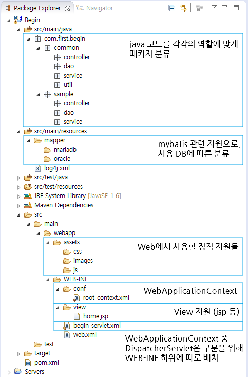

## Spring 프로젝트 구조

- **src** 디렉토리 내부에는 **main**과 **test**가 있다. **test**의 경우 프로젝트를 진행 할 때 JUnit등을 사용하기 위한 디렉토리이며, **main** 디렉토리 에는 **java, resource, webapp ** 3가지의 디렉토리로 구성되어 있고, Spring 프로젝트에서는 위 3개의 관점으로 분리되어 있다.

- java에는 작성된 java파일
- resources에는 java코드에서 사용하기 위한 리소스
- webapp는 web에서 사용하는 자원을 관리하는곳으로 jsp, js, css 또는 xml 설정파일 등이 있다.