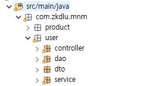
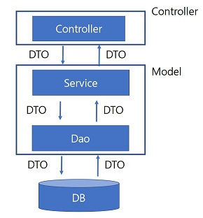
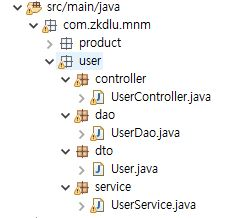

## 만들면서 따라하는 실전 Spring

+ Spring은 MVC패턴으로 프로젝트가 구성되어 있다. 따라서 프로젝트를 개발하는데 앞서 패키지를 잘 구성해두어야 한다.  



위 프로젝트는 인터넷 쇼핑몰을 만든다는 시나리오로 예를 들것이다

쇼핑몰에서 사용되는 도메인은 유저와 제품이 있다. 따라서 패키지를 유저 패키지와 제품 패키지를 만들고 각 패키지 내부에 controller, service, dao, dto 패키지가 있다.


spring으로 특정 url이 request가 오면 호출 순서는 다음과 같다.

1. Controller는 수신한 url에 따라 Service를 호출한다.
2. Service는 Dao를 호출한다.
3. Dao는 DB에 접근하여 저장된 데이터들을 가져와 Service로 반환해준다.
4. Service는 Dao가 반환한 데이터를 Controller에게 반환한다.
5. Controller는 Service가 반환한 결과를 Client에게 전달한다.



위 순서대로 프로젝트를 작성해보자

/users 로 Spring을 호출하면 DB에 저장된 유저 목록을 반환해주는 예제이다.

--------------

### 1. DTO 만들기

- 각 계층간 데이터 교환이 용이 하도록 User를 정의 해준다.

```java
public class User {
	private String name;
	public String getName() {
		return name;
	}
	public void setName(String name) {
		this.name = name;
	}
}
```

각 계층간 통신은 User 클래스를 이용한다. 

### 2. DAO 만들기

- 본래 DB에 접근하기 위해 Orm, Jdbc, Mybatis, JPA등을 사용하여야 하지만 간단한 예제를 위해 임의로 데이터를 입력해주도록 한다.

```java
@Repository("userDao")
public class UserDao {
	public List<User> userList() {
		List<User> users = new ArrayList();
		User user1 = new User();
		user1.setName("one");
		User user2 = new User();
		user2.setName("one");
        
		users.add(user1);
		users.add(user2);
		
		return users;
	}
}
```

### 3. Service 만들기

- Service에서는 Dao를 호출하여 데이터를 가져와 로직 처리 후 반환해준다.

```java
@Service
public class UserService {
	@Autowired
	UserDao userDao;
	public List<User> getUserList() {
		return userDao.userList();
	}
}
```

> @Autowired는 의존관계 주입에 대해 공부하여야 한다.
>
> 이를 사용해 느슨한 결합의 형태를 만들 수 있고 런타임시에 의존관계가 결정되기때문에 유연한 구조를 가진다.

### 4. Controller 만들기

- 마지막으로 handling을 할  Controller를 만들어준다.

```java
@Controller
public class UserController {
	@Autowired
	UserService userService;
	
	@ResponseBody
	@RequestMapping(value = "/users", method = RequestMethod.GET)
	public List<User> getUserList() {
		return userService.getUserList();
	}
}
```

>  마찬가지로 @Autowired를 이용해 의존관계 주입을 해주었다. 

> Service의 반환 값은 User라는 DTO로 되어있고 우리는 이 값을  json의 형태로 반환할 것이다.
>
> Spring에서 json데이터를 반환하기 위한 작업을 해준다.
>
> 이는 5번 문서를 참고하여 진행한다.

여기까지 완료가 되면 다음과 같은 디렉토리 구조를 갖게 된다.




이제 서버를 실행 시킨 후 인터넷 브라우저에서 해당하는 url로 호출 해본다.

url: localhost:8080/users

그렇다면 아래와 같이 브라우저에서 정상적으로 json 데이터를 가져온것을 확인 할 수 있다.

