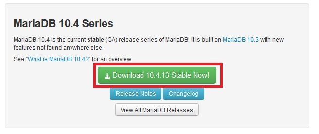
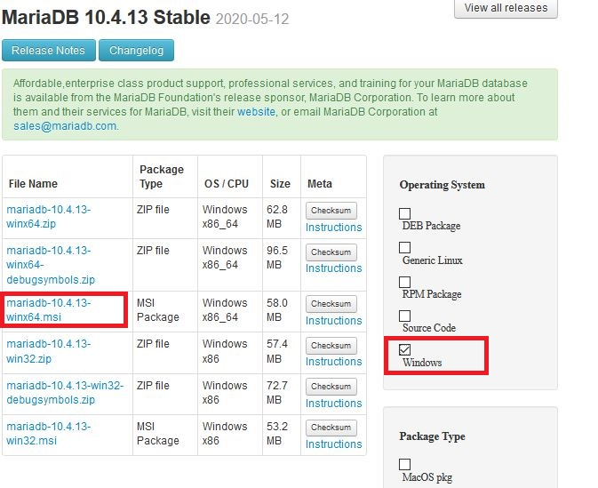

## MariaDB 설치

1. MariaDB (https://mariadb.org/) 접속 후 Download 로 이동

2. 10.4.13 버전을 다운로드 하자

3. OS로 Windows 버전 선택 후 설치 파일 다운로드 하여 설치한다.

4. MySQL Client (MariaDB 10.4 (x64))가 설치 되었다면 완료 

참고

https://goddaehee.tistory.com/201