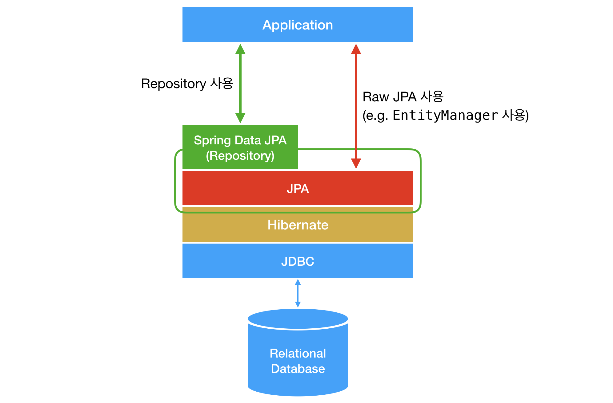

## ORM

- Object Relational Mapping (객체와 DB의 테이블을 매핑 해주는 프레임워크)
- 프로그램의 복잡도를 줄이고 객체와 쿼리를 분리 할 수 있으며, 트랜잭션 처리나 기타 데이터베이스 관련 작업들을 편리하게 처리할 수 있는 방법

## JPA

+ Java Persistence API  (자바 ORM 기술에 대한 API 표준 명세)
+ ORM을 사용하기 위한 인터페이스를 모아둔 것
+ 자바 어플리케이션에서 관계형 데이터베이스를 사용하는 방식을 정의한 인터페이스
+ ORM에 대한 자바 API 규격이며 Hibernate, OpenJPA등이 JPA를 구현한 구현체
+ EclipseLink, DataNucleus, OpenJPA, TopLink 등이 있음

### Hibernate

- JPA를 사용하기 위해  JPA를 구현한 ORM 프레임워크 중 하나
- javax.persistence.EntityManager와 같은 JPA 인터페이스를 직접 구현한 라이브러리

jpa, hibernate, entitymanager, repository, Spring Data JPA

**Spring Data JPA는 JPA를 쓰기 편하게 만들어 놓은 모듈**

https://victorydntmd.tistory.com/202

 