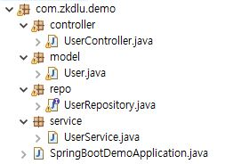
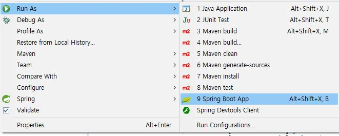

## Spring Boot에서 JPA 사용하기

1. **먼저 간단하게 MariaDB에 테이블을 하나 생성해주도록 하자.**

   ```sql
   CREATE TABLE user(
       id int NOT NULL AUTO_INCREMENT,
       name varchar(30) NOT NULL,
       PRIMARY KEY(id)
   );
   ```

   테이블이 만들어졌는지 확인 후 스키마를 확인하자.

   ```sql
   show tables;
   
   DESC user;
   ```

   

2. **Spring Boot에서 사용 하기 위해 pom.xml에 의존을 추가하자.**

   ```xml
   <dependency>
   	<groupId>org.mariadb.jdbc</groupId>
   	<artifactId>mariadb-java-client</artifactId>
   </dependency>
   
   <dependency>
   	<groupId>org.springframework.boot</groupId>
   	<artifactId>spring-boot-starter-data-jpa</artifactId>
   </dependency>
   
   <dependency>
   	<groupId>org.springframework.boot</groupId>
   	<artifactId>spring-boot-starter-web</artifactId>
   </dependency>
   ```

   > mariadb-java-client : mairadb에 접속하기 위한 Connector
   >
   > spring-boot-starter-data-jpa : Spring Boot용 JPA
   >
   > spring-boot-starter-web : Spring MVC를 사용한 서비스를 개발하기 위해 사용한다.


3. **프로젝트 패키지를 구성해보자  Spring Framework에서 공부한 내용과 동일하다. 이름만 요즘식으로 살짝 조정해주자. **

   > Controller, Service, Model (DTO대신), Repo (Dao대신) 

   


4. **model 패키지에 User 엔티티를 추가한다.**

   ```java
   @Entity
   @Table(name = "user")
   public class User {
   	@Id
   	@GeneratedValue(strategy = GenerationType.AUTO)
   	private int id;
       
   	@Column(name = "name")
   	private String name;
   
   	public User(String name) {
   		this.setName(name);
   	}
   	protected User() {
   	}
       
   	public int getId() {
   		return id;
   	}
   
   	public void setId(int id) {
   		this.id = id;
   	}
   
   	public String getName() {
   		return name;
   	}
   
   	public void setName(String name) {
   		this.name = name;
   	}
   }
   
   ```

   > @Entity : 엔티티 클래스임을 지정하며 테이블과 매핑된다.
   >
   > @Table : 엔티티가 매핑될 테이블을 지정하고 생략시 엔티티 클래스 이름과 같은 테이블로 매핑된다.
   >
   > @Id : 테이블에서 primary key를 가지는 변수를 뜻한다. 
   >
   > @GeneratedValue : 해당 id값을 어떤 방법으로 자동 생성할지 전략을 선택 할 수 있다.
   >
   > @Column : 데이터베이스의 컬럼을 매핑한다. 이름이 동일하다면 Table과 같이 필수는 아니다.


5. **이제 드디어 JPA를 사용해보자**

   ```java
   public interface UserRepository extends JpaRepository<User, Integer> {
   }
   ```
   
- 위 같이 JpaRepository를 상속받은 인터페이스만 생성하면 Spring boot에서 자동으로 구현체를 만들어준다.  JpaRepository의 사용법은 추가적으로 학습하자
   - JpaRepository를 상속받을 때는 사용될  Entity클래스와 ID값이 들어가게 된다. 위 프로그램에서는 Entity는 User가 되고 User의 id타입인 Integer를 사용한다.


6. **Service를 만든다.**

   ```java
   @Service
   public class UserService {
   	@Autowired
   	UserRepository userRepo;
   	
   	public List<User> findAll() {
   		return userRepo.findAll();
   	}
   	
   	public void save(String name) {
   		userRepo.save(new User(name));
   	}
   	
   	public void delete(int id) {
   		userRepo.deleteById(id);
   	}
   }
   ```

   - JpaRepository가 제공하는 기본 메서드들이다. Entity 하나에 대해 아래의 기능을 제공한다.

     | 메서드 | 기능               |
     | ---- | ------------------ |
     | save()   | 레코드 저장 (insert, update) |
     |findOne() | primary key로 레코드 찾기 |
     |findAll() | 전체 레코드 불러오기, 정렬(sort), 페이징(pageable)가능 |
     |count() | 레코드 갯수 |
     |delete.. | 레코드 삭제 |
     등 여러개가 있다. 그 외에도 프로퍼티 내용에 따라 인터페이스내에 메서드를 추가하면 자동으로 추가된다.
     
     ```java
     public interface UserRepository extends JpaRepository<User, Integer> {
         List<User> findByName(String name);
     }
     ```
     
     이렇게 추가하면  JPA가 자동으로 만들어준다. 위 메서드를 사용하기 위해 Service에도 다시 추가해보자
     
     ```java
     @Service
     public class UserService {
     	@Autowired
     	UserRepository userRepo;
     	
     	public List<User> findAll() {
     		return userRepo.findAll();
     	}
     	// 추가 된 service
     	public List<User> find(String name) {
     		return userRepo.findByName(name);
     	}
     	
     	public void save(String name) {
     		userRepo.save(new User(name));
     	}
     	
     	public void delete(int id) {
     		userRepo.deleteById(id);
     	}
     }
     ```
   


7. **마지막으로 Controller를 만들어준다.**

```java
@RestController
public class UserController {
	@Autowired
	UserService userService;

	@GetMapping("/insert")
	public String insert(@RequestParam("name") String name) {
		userService.save(name);
		return "insert Done";
	}
	
	@GetMapping("/find")
	public List<User> find(@RequestParam("name") String name) {
		return userService.find(name);
	}
	
	@GetMapping("/delete")
	public String delete(@RequestParam("id") int id) {
		userService.delete(id);
		return "delete Done";
	}
	
	@GetMapping("users")
	public List<User> findAll() {
		return userService.findAll();
	}
}
```

> @RestController :  @Controller + @ResponseBody 의 축약형으로써, 리턴값을 뷰리졸버로 매핑하지 않고 그대로 출력해준다.
>
> @GetMapping : @RequestMapping(method = RequestMethod.GET) 의 축약형이다. 이 외에도 PostMapping, PutMapping DeleteMapping등이 있다.


8. **완성 된 프로젝트를 실행 후 정상적으로 동작하는지 확인하자 **

   
   
   아마 정상적으로 실행이 되지 않고 DataSource가 뭐라뭐라 하는 오류메시지가 출력 될 것이다. 깜빡했다.

9. **src/main/resources/application.properties에 DataBase 정보를 기입해준다.**

   프로그램이 db에 접속하기 위한 데이터 소스 구성 요소를 설정해주어야 한다.

   ```properties
   spring.datasource.url=jdbc:mariadb://localhost:3306/example_db
   spring.datasource.username=root
   spring.datasource.password=root
   spring.datasource.hikari.auto-commit=true
   ```

   > 나의 경우 mariadb를 사용하고 포트는 3306번이며 데이터베이스 명은 example_db를 사용하였다.
   >
   > spring.datasource.hikari.auto-commit을 false로 하면 프로그램 종료 후 원 상태로 돌아온다.
   >
   > 이 외에도 설정 할 수 있는 것이 많다.

10. **이제 실행하면 진짜 될 것이다. 매핑된 url로 접속 시도 해보자 **
    - localhost:8080/users
    - localhost:8080/insert?name=이름
    - localhost:8080/find?name=이름
    - localhost:8080/delete?id=id값