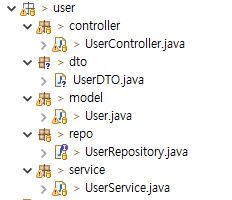
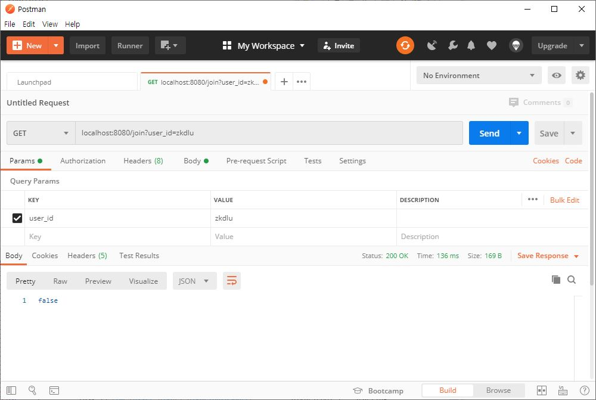
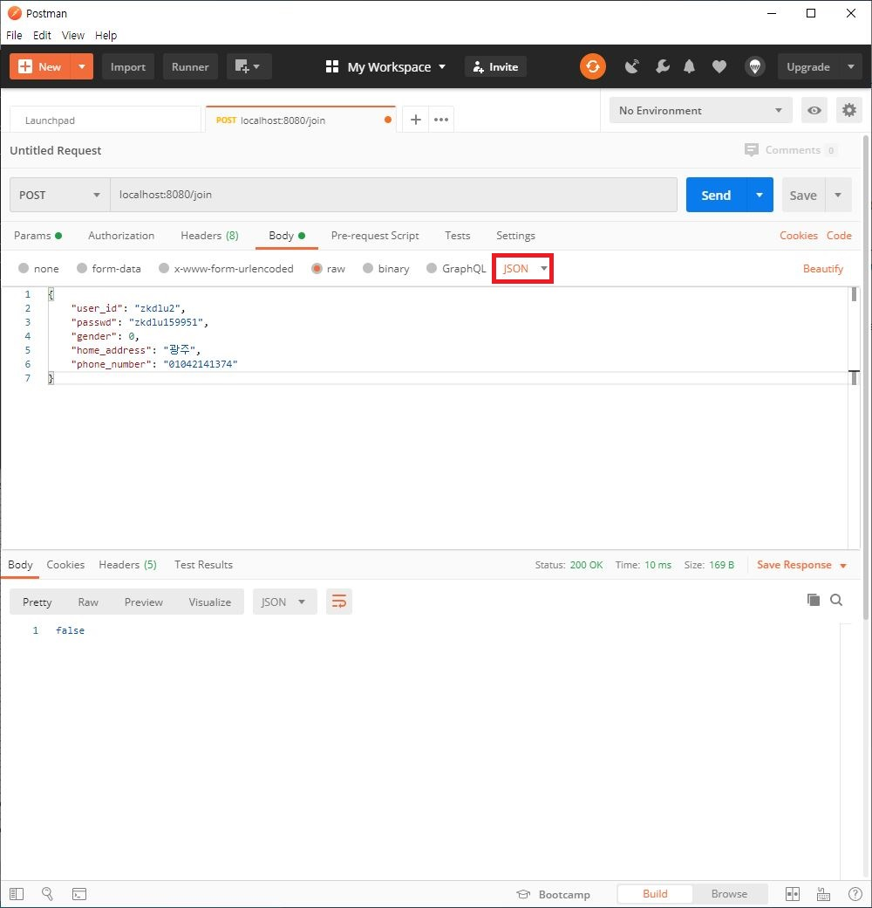

# 프로젝트 - 중복확인, 회원가입



## 중복확인
- method: GET
- url: /join
- query string: user_id
- return type : boolean
- UserController ->  isOverlapId
- UserService -> isOverlapId
- UserRepository -> findById


1. User Model 정의
	
```java
	@Entity
	@Table(name = "user")
	public class User {
		@Id
		@GeneratedValue(strategy = GenerationType.AUTO)
		private int pk;
	
		@Column(name = "id")
		private String id;
	
		@Column(name = "passwd")
		private String passwd;
	
		@Column(name = "gender")
		private int gender;
	
		@Column(name = "homeAddress")
		private String homeAddress;
	
		@Column(name = "phoneNum")
		private String phoneNum;
	
		@Column(name = "state")
		private int state;
	
		public int getPk() {
			return pk;
		}
	
		public void setPk(int pk) {
			this.pk = pk;
		}
	
		public String getId() {
			return id;
		}
```


​	
2. UserRepository에 findById 메서드 재정의

  ```java
  public interface UserRepository extends JpaRepository<User, Integer> {
  	List<User> findById(String id);
  }
  ```

  

3. UserService에 isOverlapId 메서드 정의

  ```java
  @Service
  public class UserService {
  	@Autowired
  	UserRepository userRepo;
  	
  	public boolean isOverlapId(String user_id) {
  		return userRepo.findById(user_id).size() != 0; 
  	}
  }
  ```

  

4. UserController에 isOverlapId 메서드 정의

  ```java
  @RestController
  public class UserController {
  	
  	@Autowired
  	UserService userService;
  	
  	@GetMapping("/join")
  	public boolean isOverlapId(@RequestParam("user_id") String id) {
  		return userService.isOverlapId(id);
  	}
  }
  ```


5. 프로젝트 실행 후 PostMan으로  작동을 확인한다.

   


## 회원가입
- method: POST
- url: /join
- body data: { user_id, passwd, name, gender, home_address, phone_number }
- return type : boolean
- UserController ->  join
- UserService -> join
- UserRepository -> save


1.  UserController에 join 메서드를 정의한다.

   ```java
   @RestController
   public class UserController {
   	@Autowired
   	UserService userService;
       
   	@PostMapping(path = "/join")
   	public boolean join(@RequestBody UserDTO userDTO) {
   		return userService.join(userDTO);
   	}
   }
   ```

   Post 메서드의 경우 json의 형태로 body data에 넘어오는데 이를 감싸는 클래스인 UserDTO 클래스를 만들어야 한다. 

   > DTO (Data Transfer Object) : Controller, Service 등 계층간에 데이터 교환을 위한 객체


2. UserDTO 정의

   ```java
   public class UserDTO {
   	private String user_id;
   	private String passwd;
   	private int gender;
   	private String home_address;
   	private String phone_number;
       
   	public String getUser_id() {
   		return user_id;
   	}
   
   	public void setUser_id(String user_id) {
   		this.user_id = user_id;
   	}
   
   	public String getPasswd() {
   		return passwd;
   	}
   
   	public void setPasswd(String passwd) {
   		this.passwd = passwd;
   	}
   
   	public int getGender() {
   		return gender;
   	}
   
   	public void setGender(int gender) {
   		this.gender = gender;
   	}
   
   	public String getHome_address() {
   		return home_address;
   	}
   
   	public void setHome_address(String home_address) {
   		this.home_address = home_address;
   	}
   
   	public String getPhone_number() {
   		return phone_number;
   	}
   
   	public void setPhone_number(String phone_number) {
   		this.phone_number = phone_number;
   	}
   }
   ```

   @RequestBody에 매핑 되기 위해서는 json 형태로 오는 body data와 이름이 같아야 한다. 


3. UserService에 join 메서드 구현

   null 체크 후 id 중복 되지 않은지 검사 후, 데이터베이스에 저장한다.

   ```java
   public boolean join(UserDTO userDto) {
   	User user = new User();
   	
   	String id = userDto.getUser_id();
   	String passwd = userDto.getPasswd();
   	int gender = userDto.getGender();
   	String phoneNum = userDto.getPhone_number();
   	String homeAddress = userDto.getHome_address();
   	
   	if (id == null || passwd == null
   			|| phoneNum == null || homeAddress == null) {
   		return false;
   	}
   		
   	user.setId(id);
   	user.setPasswd(passwd);
   	user.setGender(gender);
   	user.setPhoneNum(phoneNum);
   	user.setHomeAddress(homeAddress);
   		
   	try {
   		if (!isOverlapId(id)) {
   			userRepo.save(user);
   			return true;
   		} else {
   			return false;
   		}
   	} catch (Exception e) {
   		return false;
   	}
   }
   ```


4. 실행 후 PostMan으로 확인해 본다.

   > 꼭, json으로 설정해야 한다.



